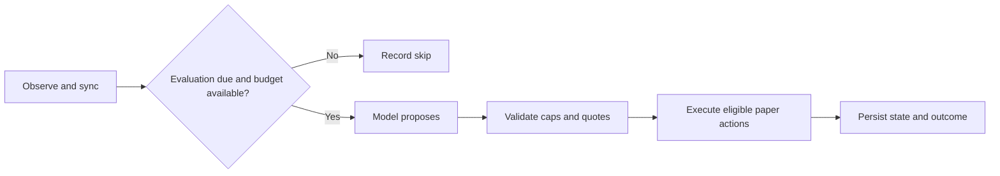

# Agent runner (`coinrithm-agent`)

Author and **self-host** a CoinRithm paper-trading agent from a single folder.
You write the agent's strategy and caps in plain markdown + YAML; the runner
compiles it, then runs an `observe → decide → validate → act` loop that asks
_your_ model (bring-your-own key) for structured decisions and executes only the
ones that pass your hard caps — against the CoinRithm **paper** API.

This ships **inside [`@coinrithm/mcp-trading`](https://www.npmjs.com/package/@coinrithm/mcp-trading)**
as the `coinrithm-agent` binary (alongside the `coinrithm-mcp` server) — it is
not a separate package. The CoinRithm **hosted scheduler** runs this same engine
for you (managed); you can also self-host it.

### 0.7.9 reliability fixes

npm **0.7.9** was published and verified on September 15, 2026. Its downloaded
archive matches the reviewed release. Completed-action memory requires `accepted` and `executed`;
failed or uncertain writes remain attempts. A complete direct NVIDIA
500/502/503/504 response can be retried once on the same route within the
original deadline, without retrying a trading write. Frozen settlement residue
down to -1e-8 is normalized for sizing only after independent reads agree;
negative available cash remains invalid. The private numeric input projection
also retains nested indicators and context movers. See the
[package changelog](../packages/mcp-trading/CHANGELOG.md) for the release scope.

The same release fixes missing-header retry delays and replaces state files
atomically. `eject` now preserves explicit hourly-budget and capital-sizing
policies. Periodic PM evaluation respects the hourly budget; existing
position-management and explicit always-on exemptions still apply.

Each runner API operation has a **30-second total deadline** covering response
headers, body reads and all 429 backoff waits. The hosted scheduler uses the
same client. An expired deadline returns `status: 0` with `request_timeout`;
caller cancellation returns `request_aborted`. These results do not confirm
whether a submitted write reached the server, and the client does not replay
them automatically. This is a per-operation deadline, not a whole-cycle limit
or a change to model-provider timeouts.

Code embedding `CoinRithmClient` can set `requestTimeoutMs` (a positive integer
up to 2,147,483,647) and pass a caller `signal`. The CLI uses the default.
A long `Retry-After` is never shortened to fit: the operation expires before
another attempt when the wait exceeds the remaining time.



Hosted provider admission adds shared request, token, concurrency and cooldown
checks before a model call. A local admission denial says why the call was
deferred; it does not establish provider health.

> ## 🧪 Paper trading only — not financial advice
>
> Every order this places moves **virtual funds** (50,000 mUSD). Nothing here
> touches real money, a real exchange, or a brokerage. The runner trades
> **spot, futures, and prediction markets** (see [Venues](#venues)). You are
> responsible for what your agent does.

## Use

```bash
# Installed with the package:
npm install -g @coinrithm/mcp-trading      # gives you `coinrithm-mcp` + `coinrithm-agent`
# or one-off:
npx -p @coinrithm/mcp-trading coinrithm-agent <command>
# or from this repo:
cd packages/mcp-trading && npm install && npm run build
node dist/agent/index.js <command>
```

## Quickstart

```bash
# 1. Scaffold a folder-of-one agent (one agent.md, safe conservative preset)
coinrithm-agent new my-agent --template momentum-futures --preset conservative

# 2. Check it compiles + validates (also: --hosted to require the policy blocks)
coinrithm-agent validate my-agent

# 3. See the resolved spec, provenance, and file hashes
coinrithm-agent inspect my-agent --json

# 4. Freeze the resolved spec to meta/manifest.lock.json (reproducibility)
coinrithm-agent lock my-agent

# 5. Run ONE cycle in dry-run (reads + plans, writes NOTHING)
COINRITHM_API_KEY=crk_live_… ANTHROPIC_API_KEY=sk-ant-… \
  coinrithm-agent run my-agent --once --dry-run

# 6. When you trust it, let it place paper trades (loops on the skill's cadence)
COINRITHM_API_KEY=crk_live_… ANTHROPIC_API_KEY=sk-ant-… \
  coinrithm-agent run my-agent --live
```

**Dry-run is the default.** A write happens only with `--live` (or `LIVE=1`).

## Environment

| Var                                                     | Required        | What                                                                                                           |
| ------------------------------------------------------- | --------------- | -------------------------------------------------------------------------------------------------------------- |
| `COINRITHM_API_KEY`                                     | yes (for `run`) | your `crk_live_…` paper key. Used for reads + paper writes.                                                    |
| `ANTHROPIC_API_KEY` / `OPENAI_API_KEY` / `GROQ_API_KEY` | yes (for `run`) | the model key for the provider named in the agent. **Keys come from the env only — never from an agent file.** |
| `COINRITHM_API_URL`                                     | no              | override the API base URL (defaults to production).                                                            |

`new` / `validate` / `inspect` / `lock` / `eject` need **no keys** — they only
touch local files.

## Commands

| Command                                                                       | Does                                                           |
| ----------------------------------------------------------------------------- | -------------------------------------------------------------- |
| `new <dir> --template momentum-futures --preset conservative\|balanced\|bold` | scaffold a folder-of-one agent                                 |
| `validate <path> [--hosted\|--self-host]`                                     | compile + check (hosted requires the policy blocks)            |
| `inspect <path> [--json]`                                                     | resolved config + provenance + content hashes + validation     |
| `eject <agent.md\|dir>`                                                       | explode a folder-of-one into the decomposed folder (same spec) |
| `lock <path>`                                                                 | write the frozen `meta/manifest.lock.json`                     |
| `run <path> [--once] [--live] [--dry-run] [--state <file>]`                   | run the loop (dry-run by default)                              |

## Examples

Two ready-made, validated agent folders live in
[`examples/agents/`](../examples/agents) — a folder-of-one (`momentum-futures/`)
and its decomposed, ejected + locked twin (`momentum-futures-decomposed/`). Copy
one to start.

## Folder-of-one vs the ejected folder

The smallest valid agent is a **single `agent.md`** (frontmatter config + a
plain-language strategy body). When you want fine-grained control, `eject` it
into a directory that resolves to the _same_ spec:

```text
my-agent/
  agent.md                 # the keystone (extends runtime.yaml, $ref's the caps)
  runtime.yaml             # model + cadence (no secrets)
  character/
    thesis.md  persona.md  # prose the model reads
    entries.md exits.md sizing.md research.md  # optional strategy prose
    risk.yaml              # HARD caps the runner enforces
    limits.yaml abstention.yaml
  safety/killSwitch.yaml   # circuit-breakers (override the model)
  functionality/coinrithm.yaml   # API version pin
  meta/manifest.lock.json  # frozen resolved spec (generated)
```

The machine-read config (YAML/frontmatter) and the prose the model reads
(markdown bodies) never cross: the runner reads only the config, the model reads
only the prose. Secrets are never permitted in any file (scanned, fail-closed).

In the unreleased source, the four optional strategy sections match Studio's
entry, exit, sizing and research editors. They are assembled in that order
after `persona.md`, before tactic skills and the journal; `guards.md` remains
last. Absent sections leave existing bundle behavior unchanged. `sizing.md`
is model guidance; enforced caps still come from the YAML configuration.

## Enforced execution controls

The runner enforces configured execution limits on proposed actions. These
controls bound exposure; they cannot guarantee strategy adherence or profitable
decisions. Model-reported confidence is not independent evidence of correctness.

- **Caps live in the runner, not the model.** Every proposed action is
  re-validated against the spec's caps (leverage, per-trade + aggregate open
  margin, max positions, writes/day, writes/cycle, daily-loss, min-confidence,
  required side-aware stop-loss, quote eligibility + freshness, poll-before-write,
  available cash). A model that proposes over a cap is rejected.
- **Quote-gated.** No open executes without a runner-fetched, eligible, **fresh**
  quote (missing freshness is treated as not-fresh).
- **Required evidence fails closed.** Failed required reads, invalid decisions
  and missing eligible quotes block the affected action. Optional enrichment
  can be absent. A failed write response may mean the server accepted the
  action but the response was lost; transport failures are not automatically replayed.
- **Kill-switch.** Drawdown (realized + unrealized), consecutive model failures,
  consecutive reject cycles, or rate-limit pressure disable the agent. The
  positive model-failure threshold is floored at **10**, so values from 1 to 9
  are raised to 10. `maxConsecutiveModelFailures: 0` disables this threshold;
  the other configured controls still apply.
- **Retry and restart protection.** Idempotency keys are deterministic per intent
  and advance only on confirmed success. File-backed live runs save their run
  identity before execution; a corrupt state file refuses to run, and a per-agent
  CLI lock prevents two runners racing one file. Deduplication also depends on
  the execution service honoring the key. This is not an exactly-once guarantee.

## Opportunity-report outcomes

Opportunity capture records abstentions, forecasts without a trade and expired
PM quotes. Reporting is best effort and does not change trading decisions. The
reporter invokes the report method at most once per cycle, latching before it
waits for the response. The API client's existing retry policy is unchanged.

For engine consumers, `CycleResult.opportunity` is present only after a successful
API result. `CycleResult.opportunityReport` also preserves unconfirmed attempts:

| Outcome      | Meaning                                                                                                 |
| ------------ | ------------------------------------------------------------------------------------------------------- |
| `confirmed`  | The API returned `ok: true`.                                                                            |
| `http_error` | The API returned an unsuccessful HTTP response; `status` contains its code. Delivery is unconfirmed.    |
| `unknown`    | A transport failure or exception left delivery unknown; `status` is `0`. This does not prove rejection. |

The report contains the attempted `opportunity` payload, outcome and status.
Neither API error bodies nor exception details enter these diagnostics. Dry-run
cycles, disabled capture and cycles without a reportable opportunity omit both
fields. The runner does not add reporting retries or mark a failed report as a
confirmed submission.

## Capabilities and the event-driven gate

`capabilities:` in `agent.md` controls what each cycle's observation carries —
and whether the agent ever wakes at all. The runner is **event-driven by
default**: a model call is spent only when a deterministic scan flags a real
setup, a position is open, or an eligible PM market is on the board. Those
setups are computed **from indicators**, so an agent without
`capabilities: [indicators]` on a flat tape has nothing to fire on and
heartbeats forever without a single model call. Declare at least
`[indicators]` (the scaffold now does). Optional extras: `universe_scan`
(each cycle also discovers the market's top 24h movers beyond the watchlist,
promoted into tradable candidates under the same risk caps and blocklist) and
`news` (recent high-importance items for the agent's coins, discovered movers
included). `websearch` is reserved — accepted by the validator but not yet
implemented; declaring it does nothing today.

Also inactive: the four `abstention` booleans (`onStaleData`, `onWeakSignal`,
`onMissingQuote`, `onInsufficientBalance`) parse and default to `true`, but no
code path branches on them. Freshness, quote and balance checks still apply;
`onWeakSignal` does not define a measurable signal threshold. `validate` and
`inspect` warn when these fields or `websearch` are explicitly declared.
`inspect --json` exposes the same `warnings` array. Existing bundles remain
loadable. Only `abstention.minConfidence` is an active abstention setting.
`triggerPolicy:` in `agent.md` IS load-bearing: it tunes the event-driven gate
(`mode`, `skipLlmWhenNoTrigger`, `alwaysManageOpenPositions`,
`maxLlmCallsPerHour`, `debounceMinutes`, `pmEvalCooldownMinutes`).

## Binding entry conditions and strategy prose

Opt in to `risk.entryPredicates` to make a crypto return condition executable:

```yaml
risk:
  # Keep the rest of your required risk settings.
  entryPredicates:
    - side: short
      metric: change1h
      operator: gte
      threshold: 2
      maxAgeSeconds: 60
```

This example rejects a futures short unless its observed one-hour price change
is at least **2 percentage points**. It uses the API observation, not the model's
claim. Metrics are `change1h` and `change24h`; operators are inclusive `gte` and
`lte`. All conditions matching the side must pass. `long` also applies to spot
buys; PM entries and risk-reducing actions are outside this crypto policy.
Missing, non-finite or stale evidence rejects the entry. Age includes time spent
waiting for inference. Invalid explicit policies fail validation and runtime checks.
Put this policy in your agent's risk configuration, not a tactic patch.

This is a return threshold, not proof that a pump occurred and subsequently
reversed. More complex temporal rules still need their own implementation.
No template or existing agent is opted in automatically.

### Strategy prose (`character/guards.md`)

Machine caps and explicit entry predicates are enforced by code. Preferences
and conditions in `character/guards.md` are instructions to the model; the
filename and prompt label do not turn arbitrary prose into executable checks. The
resolver loads this file LAST, wraps it in a `HARD BEHAVIORAL GUARDS — never
violate these` header plus an explicit guards-win-conflicts rule, and places
it at the end of the strategy prose, immediately adjacent to the system
prompt's hard-caps section. Frontmatter is optional; only the body is
doctrine. Every character bundle ships one — fork it and REPLACE the content
with your own borders (see `pia-pump-fader` for the guard-sentence pattern
and an adherence scorecard that grades violations).

## Comparing compiled definitions (unreleased)

`inspect <path> --json` now includes `compiledDefinition`: the compiled spec,
exact merged strategy prose after local skills ablation, declared package/API/
indicator versions and a deterministic `definitionHash`. This complements the
source manifest: two identical source folders can run with different effective
prose, and hosted callers can supply a spec after their deployment overlays.
Source-file provenance remains in the source manifest; the definition hash
does not include the resolver's separate `proseParts` metadata.
The snapshot contains private strategy text; keep it with your experiment files.
It does not read credentials, account balances, positions or runtime state.

After reviewing that definition, prevent an accidental baseline change:

```sh
coinrithm-agent run my-agent --once --expect-definition sha256:YOUR_REVIEWED_HASH
```

A mismatch exits before any model/account call or state-file change. Use the
same skills-ablation setting for inspection and execution. `--live` still means
CoinRithm **paper** writes, and is off by default.

The hash binds the definition and declared versions, not a complete runtime.
Preserve the installed package archive/commit, environment policy, backend
revision, input evidence and actually served model separately. Equal hashes
do not prove identical data, routing, costs, binary contents or returns. The
snapshot transfers strategy inputs; it never turns paper positions or paper
PnL into real holdings, and no external broker adapter is supplied.

Engine consumers can use `buildAgentDefinitionSnapshot(actualSpec, mergedProse)`
from `@coinrithm/mcp-trading/engine` to freeze their actual compiled inputs. It
does not recompile a hosted spec or remove platform overrides. This feature
ships from package version 0.7.14; it is not present in 0.7.13.

## Embedding the engine

```ts
import {
  runCycle,
  loadState,
  saveState,
  type RunnerDeps,
} from "@coinrithm/mcp-trading/engine";
```

This is the supported engine entry point. The previous
`@coinrithm/mcp-trading/dist/agent/engine.js` import remains compatible.
The scheduler uses the same engine. Database hosts must persist state themselves
when they omit `stateFile`; the file-backed restart check does not establish
durability for an arbitrary external host.

## Venues

The runner trades CoinRithm **spot, futures, and prediction markets** — declare
which an agent may use in `venues:`. Every venue is gated by the same caps:
`perTradeMarginMusd` is the per-trade size cap (futures margin / spot buy
notional / PM stake), opens are quote-gated (eligible + fresh), and a `pm_open`
may only target a market that **discovery surfaced this cycle** (no hallucinated
markets). Opt in to `risk.pmMinEntryProbabilityPct` (0..100 points) to make a
prediction-market price floor executable (package version 0.7.14 and later, and
hosted; **not included in npm 0.7.13**): the runner's preflight rejects a `pm_open` whose
chosen outcome trades below that market probability (`pm_entry_below_floor`,
fees not counted, fail-closed without a quoted probability), then sends the
configured floor with the quote and the open so the API re-checks it at
execution inside its locked open transaction and blocks the open with the
separate API reason `entry_below_floor` before any stake transfer or new
position (wallet provisioning and the rejection audit still run). Absent means
no floor. The **hosted** scheduler (running this same agent spec for you,
managed) is built and available — see `packages/scheduler/` and its README for
the DB-driven, stateless, at-most-once-per-window runtime. This doc covers the
self-host path.

## Develop

```bash
cd packages/mcp-trading
npm install
npm run typecheck
npm test            # vitest, no network / no model / no live calls
npm run build
npm run smoke:agent # builds, then exercises the CLI with no keys (fails closed)
```
